> How a small style-LoRA project makes its decisions — the calibrated gates, the
> controlled A/Bs, the metric design — using three illustration sub-styles
> (painterly, storybook-sketch, ink-wash) as the worked example. Training and eval
> ran on 8× A100 (80 GB). Every figure and number is read back from reports and
> embedding/weight files saved at generation time, so the same inputs reproduce
> them.

## 0. The approach

The working rule is to replace every "looks good" with a **measured decision against
a per-dataset calibrated threshold in a single feature space**, and to treat each
knob as a **controlled A/B with a pre-declared adopt criterion and a known noise
floor.** The failure mode this guards against is the invisible one — by eye you
can't tell underfit from bad data from wrong-base-model — so nothing is adopted
because it "should" help; it's adopted because a number cleared a bar set before the
run.

Three principles run through everything:

1. **One feature space, end to end.** The same embedder (DINOv2) is used for data
   triage, coherence auditing, and final eval. "Passes curation" and "passes eval"
   therefore measure the *same* thing — no metric mismatch between the gate you
   select data with and the gate you grade output with.
2. **Calibrated thresholds, not guessed absolutes.** Every gate is a percentile of
   the *reference set's own* intra-set distribution, not a magic number like 0.75.
   Tight datasets auto-tighten; loose ones auto-relax.
3. **Measure before you spend.** Coherence, distribution drift, and per-image
   exposure are all checked as a pre-flight that can *halt the train* — detection
   moves to before the 25-minute A100 burn, not after.

---

## 1. Why DINOv2, not CLIP

The whole stack is built on DINOv2 embeddings. CLIP is *semantic* (trained on
image–text pairs, so it encodes "what is depicted"). DINOv2 is *self-supervised on
visual features*, so it weights **medium / texture / surface / style** far more
heavily than CLIP does — much closer to the axis a style LoRA is trying to lock.

It is **style-dominant, not style-pure.** DINOv2 is not invariant to subject
identity, composition, or spatial layout; the embedding stays entangled with all
three. So cosine-to-centroid is a defensible proxy for style *only* as a relative
measure with the subject distribution held roughly constant — for clustering,
outlier detection, and ranking — not as an absolute, subject-agnostic "is this
on-style" verdict. §5 engineers that constant-subject condition deliberately (eval
subjects drawn from the training distribution) and its stress test shows the metric
scoring *subject distance* the moment the condition breaks. For a project where
"style is the product," that style-dominant axis is still the right thing to gate on
where CLIP's semantic axis would punish the very subject variety the references are
built for. CLIP scores are still computed and *reported* for visibility, but they
**never gate a decision.**

This choice is upstream of everything: it's why the gates mean something, and it's
what makes a deliberate subject-*variety* reference set possible without the metric
punishing that diversity.

---

## 2. Data tier discipline (the input contract)

Two physically separate tiers, enforced by a rule and a pre-tool hook:

- **The active training set** — curated, one folder per sub-style. Training reads
  *only* from here. The set of folders that exists *is* the sub-style list,
  discovered at runtime (no central registry; adding a sub-style is a single-folder
  operation).
- **The staging / reserve pool** — collected, not curated. **Never** read by
  training.

They are not interchangeable: loading from staging would skip the manual eval gate
that decides whether an image *represents* the sub-style, silently contaminating the
LoRA — and the only fix for a contaminated LoRA is a re-train. The promotion path
from staging to active is the *only* sanctioned route and runs through a classifier
with a human review step:

```
classify (DINOv2 cosine vs each folder centroid) → CSV report → human review → copy in (never a blind move)
```

A per-label target count grows a folder toward N total in a single pass without
manual top-K selection. Floor: 20 images before a folder can train at all.

Concretely, promotion is *classifier-mediated, human-reviewed, and append-only*,
gated on a similarity threshold — and the threshold itself is calibrated (next
section) rather than fixed by hand.

---

## 3. The calibrated coherence gate (curation as a pre-flight, not an afterthought)

Reference-set coherence — "is this folder internally consistent enough to define one
style?" — is checked *before* training rather than as an eval-time question answered
post-training. It runs as a **mandatory pre-train gate**, invoked automatically by
the trainer; a non-zero exit halts the train.

It computes the **DINOv2 intra-set distribution** of the folder — every image's
cosine to the set centroid — and reports the full percentile spread:

| substyle | n | min | p10 | p25 | p50 | p75 | p90 | max | mean | std | verdict |
|---|---|---|---|---|---|---|---|---|---|---|---|
| `ink_wash` | 109 | 0.555 | 0.615 | 0.658 | 0.703 | 0.746 | 0.776 | 0.855 | 0.701 | 0.064 | PASS |

Two things fall out of this one audit:

1. **A PASS/FAIL on absolute mean + p25 floors** — does this folder cohere at all?
2. **The per-folder `p25` becomes the calibrated runtime threshold** used downstream
   by *both* the classifier and the eval grid. The folder defines its own on-style
   bar.

The same numbers drive a human-in-the-loop curation pass. An interactive view lays
out every reference thumbnail with its cosine-to-centroid, the intra-set histogram
with the mean and the p25/p10 gates drawn on it, and the caption-diversity verdict —
so trimming the weakest refs is a ranked, data-driven edit against the exact
distribution the automated gate will enforce, not a hunt by eye. The thumbnail grids
double as the first concrete look at the three sub-styles themselves: ink_wash's
limited-palette brush-and-wash, painterly's saturated gouache, storybook_sketch's
pen-and-ink storybook linework. Each panel shows that folder's own thumbnails, its
intra-set histogram, and its gates — the per-folder calibration of the previous
section, from the operator's side:

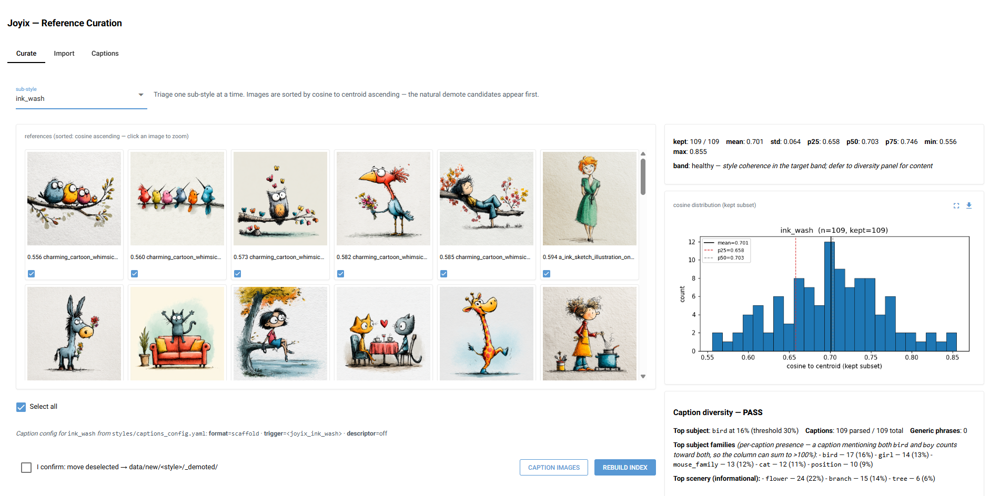

*Reference-curation view for ink_wash: thumbnails labelled with DINOv2 cosine-to-centroid, the intra-set histogram with mean and p25/p10/p5 gates, and the caption-diversity panel.*
{:.caption}

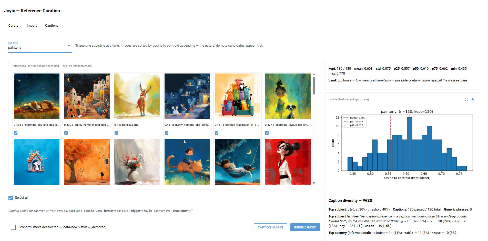

*Reference-curation view for painterly: thumbnails labelled with cosine-to-centroid, the folder's intra-set histogram with mean and p25/p10/p5 gates, and a caption-diversity PASS.*
{:.caption}

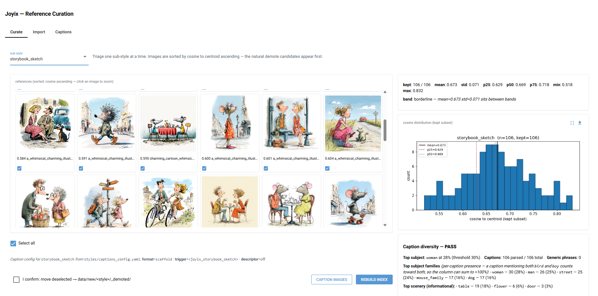

*Reference-curation view for storybook_sketch: thumbnails labelled with cosine-to-centroid, the intra-set histogram with mean and p25/p10/p5 gates, and a caption-diversity PASS.*
{:.caption}

The third panel — **caption diversity** — is a second curation axis, orthogonal to
coherence. Coherence asks *is this folder one style?* (tight in DINOv2 space);
caption diversity asks whether the *subjects* are varied enough. It reads the kept
images' bare-subject captions, counts how often the single most-common subject family
appears, and flags the folder when that share exceeds a per-folder threshold. The two
gates pull in deliberately opposite directions — coherence wants the set **tight in
style**, caption diversity wants it **broad in subject** — because a folder that is
coherent *and* subject-narrow (mostly the same animal, say) risks teaching the LoRA
the recurring *subject* instead of the *style*. Surfacing both live means a trim that
tightens style can't quietly narrow subjects unnoticed; §4 covers the captioning
side, and §9 the related out-of-domain wall.

### Calibration in the wild: three styles, three different gates

The three sub-styles land at materially different calibrated p25 gates — *not*
because anyone chose them, but because their reference sets have different natural
self-similarity:

| sub-style | ref set | calibrated gate (p25) | reading |
|---|---|---|---|
| `painterly` | ~130 imgs | **0.556** | loosest refs → lowest bar |
| `storybook_sketch` | ~106 imgs | **0.629** | mid |
| `ink_wash` | 109 imgs | **0.658** | tightest refs → highest bar |

A ridgeline reader renders this as one KDE per folder of every image's cosine to its
*own* centroid, with the folder mean (red) and the calibrated **p25 gate** (dashed)
marked:

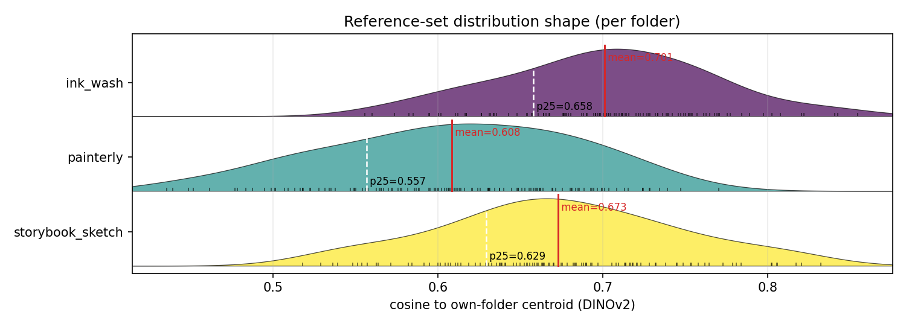

*Per-folder ridgeline of DINOv2 cosine-to-own-centroid; each curve is annotated with its mean (red) and its calibrated p25 gate (dashed). The three ridges sit at visibly different places — the calibration argument in one picture.*
{:.caption}

The picture *is* the calibration argument. The three ridges sit at visibly different
places on the x-axis — `painterly` (mean 0.608) is shifted a full ~0.09 left of
`ink_wash` (mean 0.701), with `storybook_sketch` (0.673) between them — and each
folder's dashed p25 tracks its own ridge, not a shared line. The rug ticks along each
baseline are the individual reference images, so you can also read shape (skew, any
bimodality) straight off the plot during curation.

### The 2-D view: are the sub-styles actually separable?

The ridgeline is the *1-D marginal* of each folder's embedding distribution. The 2-D
companion projects the full 768-d embeddings of all folders into one shared space and
scatters them coloured by folder — the "view the dataset in latent space" picture. It
reads the **same** cached embeddings (no GPU, no re-embed), so it's a pure reader on
a warm cache.

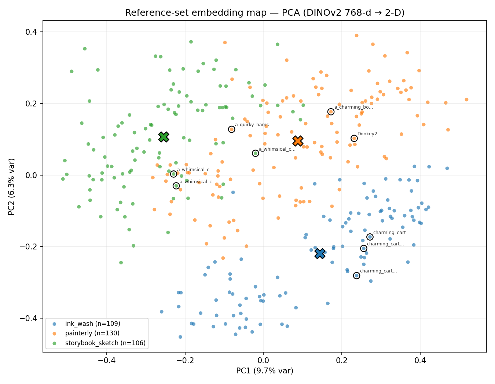

*PCA projection of the DINOv2 embeddings, one point per image coloured by folder, with folder centroids (X) and the lowest-cosine curation outliers ringed. The two axes capture only ~16% of the variance, so overlap understates separation.*
{:.caption}

The three folder centroids (X) sit in distinct regions — `storybook_sketch`
top-left, `painterly` centre, `ink_wash` bottom-right — and the ringed points are the
curation outliers (lowest cosine to their own centroid), now located spatially.
**Caveat:** the two PCA axes capture only ~16% of the 768-d variance, so visual
overlap in the projection *understates* separation. The honest,
projection-independent read is the **separability table** computed alongside — each
folder's mean cosine to its *own* centroid vs the *nearest other* centroid, in full
768-d:

| sub-style | mean own-centroid cos | nearest other | margin | nearest |
|---|---|---|---|---|
| ink_wash | 0.701 | 0.557 | **+0.144** | painterly |
| painterly | 0.608 | 0.484 | **+0.125** | ink_wash |
| storybook_sketch | 0.673 | 0.492 | **+0.181** | painterly |

Every margin is positive — the average reference image is markedly closer to its own
centroid than to any neighbour, so the three sub-styles are **empirically
well-separated under cosine geometry** (which is what licenses treating them as
distinct sub-styles and trusting the per-folder gates). This is separation in the
centroid-cosine sense — positive mean margins plus the projection above — not a formal
proof of linear separability: the PCA view captures only ~16% of the variance and the
margins are over folder means, not a guarantee that a single hyperplane cleanly
partitions every individual image. Read it as strong empirical separation, not a
theorem. The projection is PCA by default; a t-SNE / UMAP variant is also available.

A single absolute threshold (an earlier 0.70 / 0.75 / 0.90 guess) would have been
**simultaneously too strict for painterly and too lax for ink_wash** — and in fact
some folders' *own references* could not clear the absolute bar their refs would need
to clear. Per-folder p25 fixes that by construction: it auto-tightens a coherent
folder and auto-relaxes a looser one. The number is **read from the dataset, never
hardcoded** — a hardcoded count or threshold is a silent drift surface.

The gate also surfaces the **weakest refs** (lowest cosine to centroid), so curation
is a ranked, data-driven trim rather than a hunt.

---

## 4. Caption discipline: build, don't author

Captions are a **derived build artifact**, not hand-written training text. The
principle: the human edits a bare subject phrase per image; the full training caption
is *generated forward* from that subject by a single composer and is never
hand-edited.

```
bare subject  →  forward composer  →  composed caption (what the trainer reads)
(human-edited)    (applies envelope ONCE)   (NEVER hand-edited)
```

- The **source of truth** is a bare subject phrase per image — no trigger, no
  scaffold, no descriptor.
- The **composed caption** (`<trigger>, <scaffold-pre><subject><scaffold-post>,
  <descriptor>`) is generated forward by a single composer. The train pre-flight
  *verifies* each on-disk caption equals what `(subject + config)` composes to — so
  train / preview / inference **cannot drift** by construction.

Three knobs (caption *format*, whether the trigger token is present, whether a fixed
style *descriptor* is appended) have a deliberate **two-source split**:

- A **live config** drives caption authoring and new trains.
- A **per-LoRA frozen snapshot**, written next to each checkpoint at train time,
  drives *inference* — it freezes the three knobs *and the resolved envelope text*
  (descriptor string + scaffold anchors). Editing the live descriptor later does
  **not** change how an already-trained LoRA is prompted. This kills the drift
  surface where inference reads a config that's been edited since training.

### The transferable captioning finding

> **Caption what you want to VARY; omit what you want the TRIGGER to own.**

Validated by a clean A/B on ink_wash (FLUX, matched gen-seed, descriptor presence
confirmed in the training log): putting the textured-paper descriptor *into* training
captions **regressed** the result (seed_42 0.655 → 0.612, −0.043; seed_77 0.573 →
0.560), because the texture is *constant* across the set — it **is** the style, so it
belongs to the constant trigger token, not restated in descriptor words. A constant
phrase in every caption carries no discriminative gradient; it just splits "always-on
style" credit between two text loci and weakens both. The strong ~0.67 result came
from the descriptor at **inference only**. (There's an architectural reason this
bites *harder* on FLUX — see §11.)

Subject-narrowness is audited separately: a folder FAILs when its single most-common
subject family exceeds a per-folder threshold — raised where subject-narrowness is
*intentional* (a human-figure or single-character set is narrow by design, not by
accident). The three folders **pass** this audit, yet still hit an out-of-domain wall
in §9 — so the single-dominance check is necessary, not sufficient: the held-out
novel-subject tail can collapse even when no one subject dominates the training set.
The held-out diversification prompts are the probes that *expose* that wall (§5's
diversity tail), not a mitigation that was applied to the folders.

### A public dataset's captions are unvalidated input

The build pipeline is faithful by construction, which cuts both ways: a *wrong* bare
subject propagates straight into the training signal — and, since the eval subjects
are derived from the same source (§5), into the eval prompts too. So the human-review
gate sits on the **subject tier**, not the composed output, and it can't be skipped
for an auto-captioned set.

That holds doubly for a dataset pulled from a public hub. Being on a model hub says
nothing about caption fidelity — the dataset ships whatever its auto-captioner
emitted at upload. The standard `naruto-blip-captions` set (the `nrtcel` stress test
in §5) was captioned with an early BLIP: `naruto_0002`, a masked creature, is labeled
*"a man with a red hair and a black shirt"* — not partially off, *entirely* wrong. A
current BLIP2 re-caption fixes some cases, mislabels others, and folds the constant
style word ("anime") into ~60% of subjects — which the caption-what-varies rule above
says to strip anyway. An automated style-word strip clears that constant-word layer;
subject *accuracy* still needs human (or strong-VLM-then-human) review before the
source can be trusted.

---

## 5. The eval metric (graded the same way data is gated)

The eval grid is scored with the *same* DINOv2 embedder, against the *same*
per-folder calibrated gate. Five non-obvious design choices:

1. **Mean, not rate.** Generations cluster *right at* the p25 gate, so the on-style
   *rate* is a knife-edge coin-flip (it can swing 47%↔73% between adjacent
   checkpoints while the *mean* barely moves). That instability is **partly a
   metric-discontinuity artifact, not model variance**: the rate is a hard-thresholded
   count over a continuous score distribution, so when the mass piles up on the gate, a
   sub-noise shift tips many samples across the line at once — the threshold's position
   relative to the distribution inflates the rate's variance independently of any change
   in the weights. The mean is a smooth functional of the same scores and stays stable.
   Select and compare on the **mean**; report the rate.
2. **Best-checkpoint, not `final`.** The step budget is uniform and arbitrary;
   intermediate checkpoints are retained precisely to do held-out selection. Reading
   `final` penalizes whichever style peaked earlier (painterly peaks ~step3000 at 73%
   and decays to 49% by `final`). Best-checkpoint selection picks the best step per
   style/seed on the mean.
3. **In-domain prompts derived from the training distribution.** Because DINOv2
   conflates style + subject, an *off-domain* subject scores low even if rendered
   perfectly on-style. So eval subjects are **materialized from the sub-style's own
   training captions** (de-duped + diversity-filtered). This holds the subject
   distribution roughly constant so the residual cosine signal is **style-dominant** —
   a style comparison rather than a subject test. (The entanglement is controlled,
   not removed: composition still varies per generation, which is why the verdict
   rides on the mean and the gate, never a single image's score.) Eval prompts are
   committed (versioned against the dataset state), never hardcoded.
4. **The diversity tail is scored separately.** 5 held-out *novel-subject* prompts
   are graded at the relaxed **p10** gate in their own report — not folded into the
   main number at p25 (which would double-penalize out-of-domain subjects and
   understate in-domain fidelity by ~5 pp).
5. **Memorization probe.** Max nearest-reference cosine vs the ref set's own p99
   nearest-neighbour bar — distinguishes "learned the style" from "recalled a
   training image."

**Noise band as a first-class object:** the run-to-run band is std ≈ 3–6 pp (n=2
seeds). A gain counts as real only if it exceeds ~2σ (~12 pp) on the rate **or** moves
the best-checkpoint mean clearly over the gate. Every adopt decision has a
**pre-declared threshold: mean must clear the gate by > 0.02.**

### When the conflation bites: a standard-dataset stress test

Design choice #3 is easy to assert and easy to under-weight. Training a **standard
public dataset** — `naruto-blip-captions` (a canonical fine-tuning example), run here
as a deliberately non-word sub-style `nrtcel` so the trigger carries no base-model
prior — makes the conflation impossible to miss.

The SDXL LoRA trains cleanly: the best checkpoint scores **mean 0.666, rate 73%,
+0.073 over its gate (0.59)** — the highest mean of any sub-style here. (It also
plateaus mid-run: the mean reaches a ~0.65–0.67 shelf by ~step3000 and stays there
for the rest of the 11k-step run — peak step5000, and steps 7000–11000 never beat it —
so the back half of the budget added nothing; a redundant, low-variance style locks
in fast.) But the *rate* stalls at 73%, and every low scorer is a **non-portrait
subject** — scenery, animals, full-body scenes — while every high scorer (0.77–0.79)
is a character close-up. That is not a style failure:

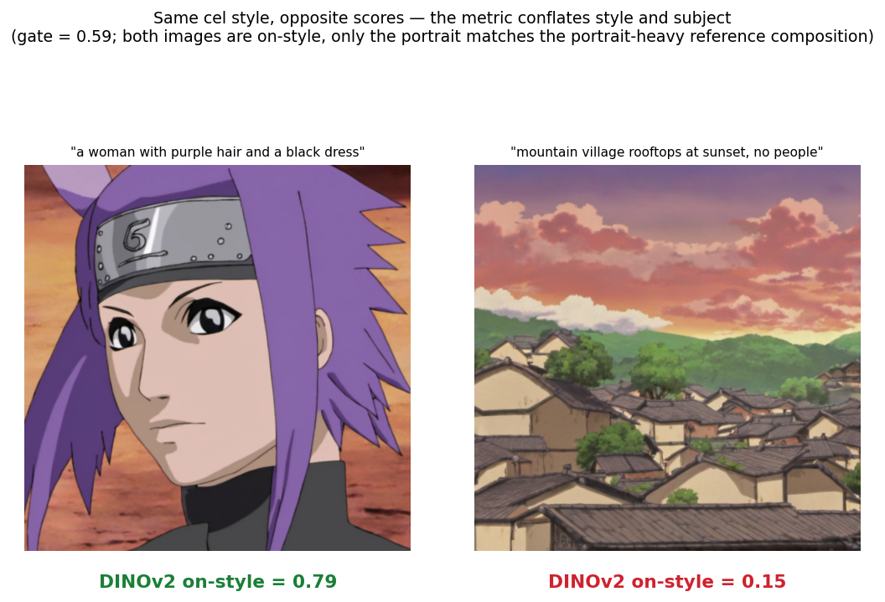

*Same LoRA, same style, opposite scores: a character portrait scores 0.79, a peopleless cel-shaded landscape 0.15. The metric is scoring subject distance, not style — why the verdict rides on the mean, never a single image.*
{:.caption}

Both images are unmistakably on-style; the portrait scores 0.79, the landscape — a
clean cel-shaded establishing shot — scores **0.15**. The reference set is almost
entirely character portraits, so a wide peopleless landscape sits far from that
centroid in DINOv2 space *whatever* its style. The metric is scoring *subject
distance*, exactly as choice #3 warns — and it bites hardest here precisely because
the references are compositionally uniform, so the in-domain rate **understates** the
LoRA's real style transfer (it renders scenes on-style better than a portrait-built
centroid can credit).

Same lesson as §9's diversity wall, sharpened: rate is a *subject-coverage* signal as
much as a style one — which is why the **mean** (choice #1) and the separately-graded
diversity tail (choice #4) are the honest numbers, and a lone rate threshold is never
a verdict by itself.

---

## 6. Experiment design

- **Dedicated results tree per experiment** — each experiment's checkpoints and eval
  outputs land under their own labelled folder, so every A/B is clean and
  identifiable from the path alone.
- **Two failure modes are tracked separately and never conflated:**
  - *In-domain underfit* (mean below gate) → recipe levers (rank, LR, scheduler, TE,
    descriptor, set size).
  - *Out-of-domain generalization* (0% diversity on novel subjects) → **data** levers
    (reference + caption subject diversity). No recipe knob touches this.
- **Seed-vs-noise separation.** Because a single training seed can land ±0.085 apart
  on a small set, a generation-seed sweep (gen-seeds × trained-seeds) separates
  *training-seed effect* (genuine weight quality) from *eval noise-draw variance*. The
  ink_wash FLUX finding: the ~0.085 training-seed gap **persists across all
  gen-seeds** (~4× the ~0.02 eval noise) → best-of-N *training* seeds is mandatory,
  not optional.
- **Common-bar cross-scoring.** A reader re-embeds the generated eval images against
  *any* chosen reference centroid + p25, so two LoRAs scored against *different*
  reference sets can be compared on one common bar.
- **Pure-reader analysis.** Every eval run stores its per-image scores, and all the
  analysis (best-checkpoint selection, seed summaries, the gen-seed sweep,
  cross-scoring) re-reads those stored scores rather than re-generating — so a metric
  change re-grades old runs without re-rendering a single image.

---

## 7. Data integrity & texture preservation

The model never trains on the reference PNGs directly — it trains on their VAE
round-trip, read from a per-image latent cache. Two links therefore sit between the
curated references (§3) and the trained weights, and the rest of this doc doesn't
otherwise check them: **what the model actually ingests** (the VAE encode→decode of
each reference) and **whether the cached inputs are clean** (no corrupt, anomalous, or
stale-from-another-base latents). Both are verifiable up front rather than inferred
from a disappointing result, and both are measured in the same DINOv2 feature space
the gates use. The two checks below cover them: texture preservation (the VAE
round-trip) and data integrity (the cached latents). Opening the LoRA's weights is a
separate question, taken up in §8. Where all of these checks sit among existing
interpretability and data-validation tooling is mapped in §13.

### Texture preservation: the VAE round-trip

The diffusion model never trains on the reference PNG — it trains on the **VAE
round-trip** of it (the trainer caches the VAE-encoded latents per image). For a
texture-defined style like `ink_wash`, an obvious suspect for the ceiling is "the VAE
smooths the ink / flattens the paper grain before the LoRA ever sees it." That's a
*verifiable* claim, not a thing to assume either way. A latent-decode reader decodes
the cached latents back to RGB (the model-space inverse of the VAE encode) and
compares each to its original — visually and in the **same DINOv2 space the gate
uses**:

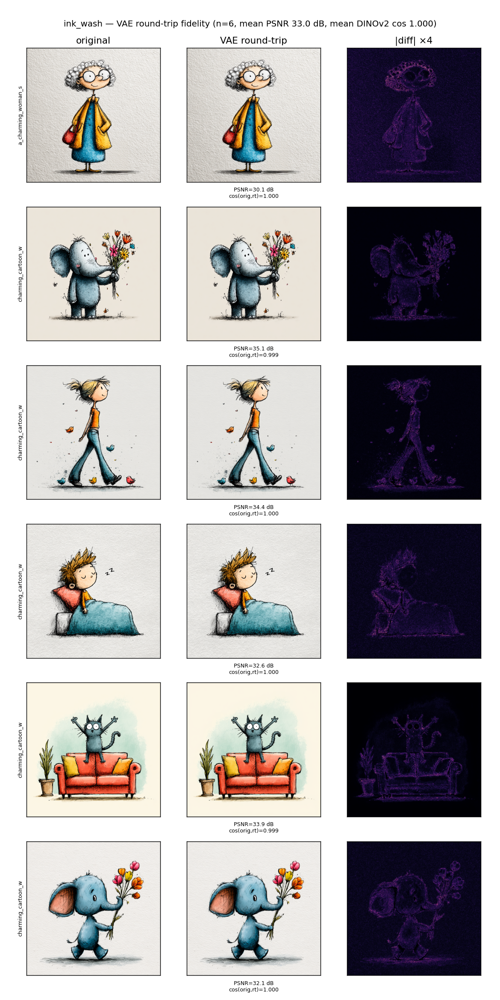

*ink_wash VAE round-trip (FLUX): original, round-trip, and amplified diff. Visually identical (PSNR 33 dB, cosine 0.9995); residue only on the finest ink-line edges.*
{:.caption}

Result: **mean PSNR 33 dB, mean DINOv2 cosine(original, round-trip) = 0.9995** — the
round-trip is indistinguishable from the original in the gating feature space, the
amplified diff showing only faint residue on the highest-frequency ink edges. That
**scopes** the conclusion rather than settling it outright. Both metrics are
relatively insensitive to the very signals a texture-defined style leans on —
micro-texture statistics, frequency-domain content, brushstroke stochasticity — PSNR
being a low-frequency-weighted global MSE, and DINOv2 the same style-dominant
embedding §1 cautions against reading as texture-complete; and the residue sits
exactly on the high-frequency ink edges where that signal lives. So the round-trip
cannot be claimed to *preserve texture* in full. What it does establish is narrower
and sufficient: whatever the VAE discards is invisible in the same DINOv2 space the
gate scores in, and so cannot be the cause of a DINOv2-measured ceiling. **The VAE is
therefore unlikely to be the dominant bottleneck, but cannot be fully eliminated as a
contributor to texture loss** — the ~0.67 ceiling is, to the metric that defines it,
downstream of the LoRA's fit rather than input fidelity, established in the gate's own
feature space before reading any training result.

### The VAE loss is base- and texture-dependent

That FLUX round-trip is the **best case**. Re-running the same probe per base and per
style — the SDXL workhorse alongside FLUX — shows input fidelity is not a single
number but a function of two compounding factors:

| style (content) | FLUX PSNR / cos | SDXL PSNR / cos |
|---|---|---|
| `nrtcel` (cel-shaded, flat) | 41.3 dB / 0.9985 | 42.1 dB / 0.9954 |
| `painterly` (brushwork) | 31.8 dB / 0.9997 | 26.7 dB / 0.9958 |
| `storybook_sketch` (ink line) | 31.1 dB / 0.9996 | 23.0 dB / 0.9946 |

PSNR here is measured in shared RGB pixel space against the *identical source image*,
not in latent space — so the FLUX↔SDXL gap *across a row* is a like-for-like
reconstruction-fidelity comparison, and the channelization difference (16-ch vs 4-ch)
is its *cause*, not a unit mismatch. Absolute dB *down a column* is a different matter:
it is content-dependent (a flat cel-shaded frame scores high almost for free), so the
cross-style differences are a trend, not a cross-style fidelity ranking.

Two factors multiply:

- **VAE channel capacity (the base).** FLUX's VAE encodes to a **16-channel** latent;
  SDXL's to **4 channels** (both at 8× spatial downsampling). A quarter of the channel
  capacity reconstructs high-frequency detail far less faithfully, so for the same
  image SDXL's round-trip PSNR is lower.
- **Content frequency (the style).** A cel-shaded set — flat colour, hard edges,
  little stochastic texture — is reconstructed almost perfectly by *both* VAEs
  (41–42 dB), and SDXL's capacity shortfall never bites, so the two bases converge.
  Brushwork and dense ink linework are high-frequency everywhere, so both bases lose
  more *and* the gap widens, because the missing SDXL channels hurt most exactly where
  the signal lives. `storybook_sketch` — finest linework, highest frequency — is the
  worst case: SDXL drops to 23 dB, an 8 dB gap, the amplified diff lighting up the
  entire line structure.

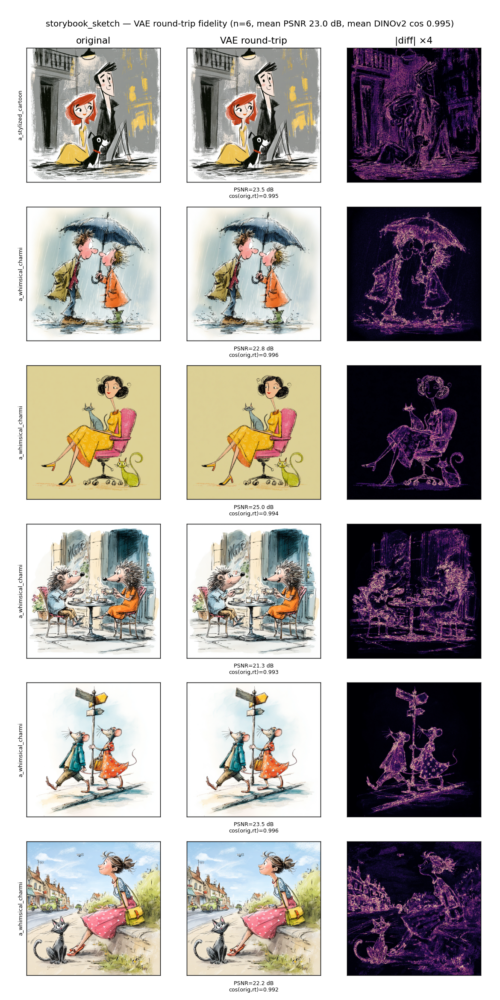

*storybook_sketch VAE round-trip (SDXL): the x4 amplified diff glows along the full ink linework (PSNR 23 dB) while the DINOv2 cosine still reads 0.995 — the metric blind spot, demonstrated.*
{:.caption}

This compounds the scoping above in two ways. First, **the headline measurement was
the best case**: it was taken on `ink_wash` FLUX (33 dB), but `painterly` and
`storybook_sketch` *ship on SDXL*, where comparable content loses 5–8 dB more. The
"VAE is unlikely to be the dominant bottleneck" reading is weaker on the platform
those styles actually train on, and "cannot be fully eliminated as a contributor to
texture loss" is concrete here — a 23 dB round-trip with the linework visibly
degraded is a real input-fidelity loss, not a rounding error.

Second, it is the **empirical demonstration of the metric blind spot** §1 names. On
`storybook_sketch` SDXL the DINOv2 cosine reads **0.9946** — "essentially identical" —
while PSNR is **23 dB** and the diff shows a large fraction of the high-frequency
signal destroyed. The embedding saturates near 1.0 and is blind to exactly the
texture loss PSNR and the eye both register. Cosine-to-centroid cannot certify
texture preservation; here it visibly fails to — which is why the round-trip verdict
rests on PSNR and the amplified diff, not the cosine.

### Data integrity: auditing the cached latents

The complement to round-trip *fidelity* is input-distribution *sanity*. A
data-integrity audit reads the cached latents as raw tensors (no VAE, no GPU) and
flags anomalies in the actual diffusion inputs — NaN/Inf, magnitude outliers (robust
median/MAD z-score within each base), near-degenerate / channel-collapsed latents, and
**foreign-base / bucket** mismatches. (This is NOT the DINOv2 style map: the VAE
latent is a reconstruction tensor, so its pooled-PCA panel groups by
*composition/colour*, not style — labelled as such.)

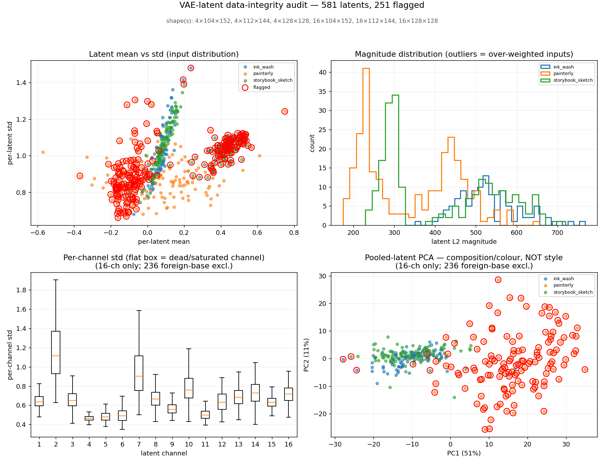

*VAE-latent data-integrity audit: per-latent mean-vs-std scatter, L2 magnitude histogram, per-channel std boxplot, and a pooled-latent PCA across the three styles, anomalies ringed. This surfaced the stale mixed-base latents.*
{:.caption}

It immediately caught a real **cache-hygiene** issue: `painterly` and
`storybook_sketch` each carry a *matched pair per image* — a stale **SDXL 4-ch** latent
left over from the SDXL runs **and** a fresh **FLUX 16-ch** latent from a later pass
(the trainer content-hashes its cache keys, so the two coexist; it reads only the set
matching the current VAE, but the cruft lingers). `ink_wash` is the only clean
all-FLUX cache. "Clear the latent cache before a re-train on a new base" became a
concrete step once the audit surfaced the leftover latents.

---

## 8. What the LoRA learned: weights, and where they act

§7 verifies the *inputs*. This reads the trained adapter itself — directly from the
weight file, with no base model loaded and nothing generated. A weight audit
reconstructs each adapted layer's update ΔW = B·A and reports, per module: the update
magnitude (‖ΔW‖_F), the effective rank of the update (energy-normalised spectral
entropy), and how many singular directions hold 90% of its energy. Singular values of
B·A come from a small r×r SVD, so the large out×in product is never formed; the audit
runs in seconds on CPU.

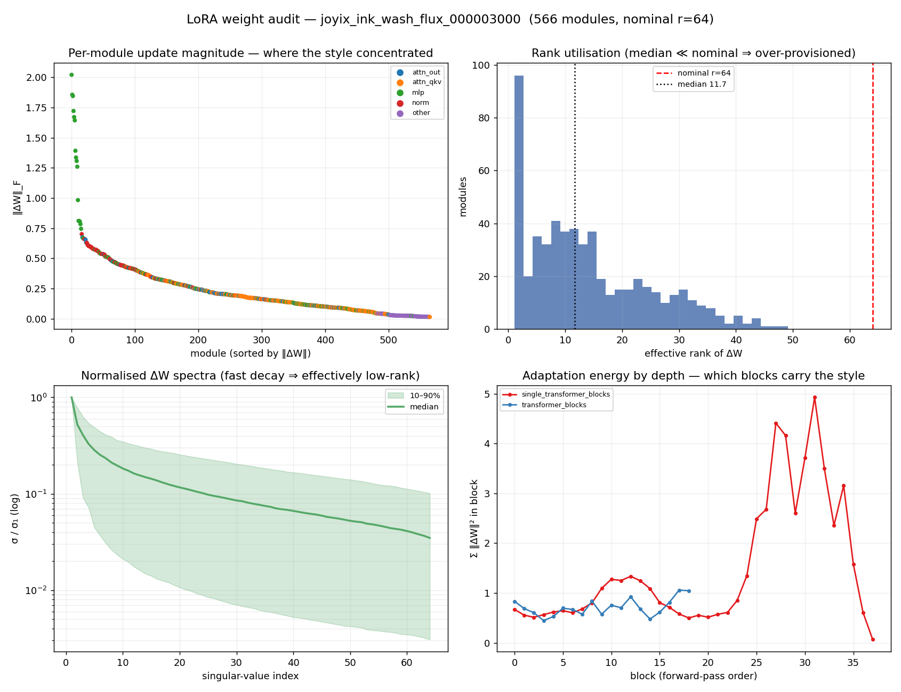

*LoRA weight audit, ink_wash FLUX: per-module update magnitude, effective rank vs nominal rank, normalised singular-value spectra, and adaptation energy by block depth — energy spiking in the late single blocks.*
{:.caption}

For the best ink_wash FLUX LoRA (rank 64, 566 adapted modules):

- **Where the style sits.** The update concentrates in the **MLP projections of the
  late single-stream transformer blocks** (`proj_mlp`, blocks ~25–35).
  Single-stream-block MLPs hold **51%** of total ‖ΔW‖² across the network, and the top
  10 of 566 modules hold **38%** of it. The depth panel (bottom-right) shows the energy
  spiking in the late single blocks while the double-stream blocks stay low — the
  adaptation is carried by a small, localised set of layers, not spread uniformly.
- **How low-rank the update is.** A median **19 of 64** directions carry 90% of a
  module's energy; the median effective rank is **11.7**, the median stable rank
  **2.4**, and the highest-norm MLP layers are **near rank-1** (effective rank ~1.5 —
  one direction holds essentially all their energy). The configured rank 64 sits well
  above what the update's energy occupies.

Two levers follow, both of which the eval grid would have to confirm rather than
assume: the rank could likely be **reduced** (low energy-rank is consistent with, but
not proof of, no quality loss), and a **block-targeted** LoRA on the late single-block
MLPs would capture most of the adaptation.

Concretely, the energy bounds a rank sweep. The median module fills only ~11–20 of its
64 directions, so:

- **rank 48** — pure headroom; the median module wasn't using 48 directions, so the
  trim should be lossless.
- **rank 32** — ~1.5–3× above the median 90%-energy occupancy (~20 directions); a
  comfortable margin.
- **rank ~24** — roughly *at* the median 90% line, where the tail of the higher-rank
  modules starts getting clipped.
- **rank 16** — below the median occupancy; expect some loss.

This band is a hypothesis for an eval-grid A/B, not a result. The audit reads the
*converged* ΔW, so it bounds how many directions the final update *occupies* — not
that training *at* a lower configured rank reaches the same solution. Lower rank
constrains the optimisation trajectory, not just the final representation, and an
over-parameterised run can locate good directions more easily even when the answer is
low-rank. The same-direction evidence is the SDXL run in §9, where dropping ink_wash
from rank 128→64 lifted the mean (+0.029, less overfit) rather than hurting it — but
that was a different base that stopped at 64, so the sub-64 FLUX trim earns its own
sweep (fixed training seed, lowest rank still within the noise band of rank 64).

### The same structure on SDXL — and on a standard dataset

The FLUX finding has a clean SDXL analogue, and it holds on the **standard
`naruto-blip-captions` set (nrtcel)** as much as on the project's own sub-styles — so
it is not an artifact of the custom data. The same audit, reading the SDXL UNet's
down→mid→up blocks:

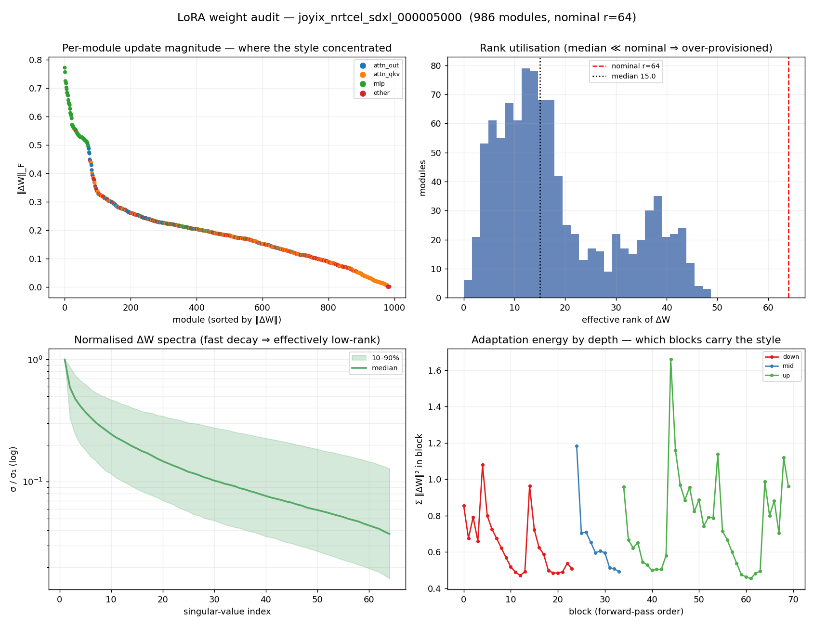

*SDXL weight audit, nrtcel (the standard naruto-blip-captions set): magnitude, rank utilisation, spectra, and energy by UNet depth — the up (decoder) blocks carry the style.*
{:.caption}

| SDXL sub-style | rank | up-block-MLP share of ‖ΔW‖² | median eff-rank |
|---|---|---|---|
| `nrtcel` (standard) | 64 | **26.8%** | 15.0 / 64 |
| `painterly` | 128 | **29.9%** | 24.7 / 128 |
| `storybook_sketch` | 64 | **34.3%** | 14.1 / 64 |

In all three the **up (decoder) block MLPs are the single largest energy bucket** —
the SDXL counterpart of FLUX's late single-block MLPs — and the update is low-rank
(median ~20–30% of the nominal rank). So the cross-architecture rule is the same:
**the style rides on the MLP / feed-forward projections of the late, decoder half of
the network, in a handful of low-rank directions** — not on attention, not on early
layers. The standard dataset behaves exactly like the bespoke ones. (`nrtcel` and
`storybook_sketch` are both rank 64 — their median eff-ranks, 15.0 and 14.1 of 64, are
directly comparable, and storybook concentrates a little more in the up-MLPs;
`painterly` is shown at rank 128, the rank it ships at, so its 24.7/128 isn't on the
same axis, but its up-MLP concentration and low utilisation match regardless. Each
style's audit reads the tensor it ships — §9.)

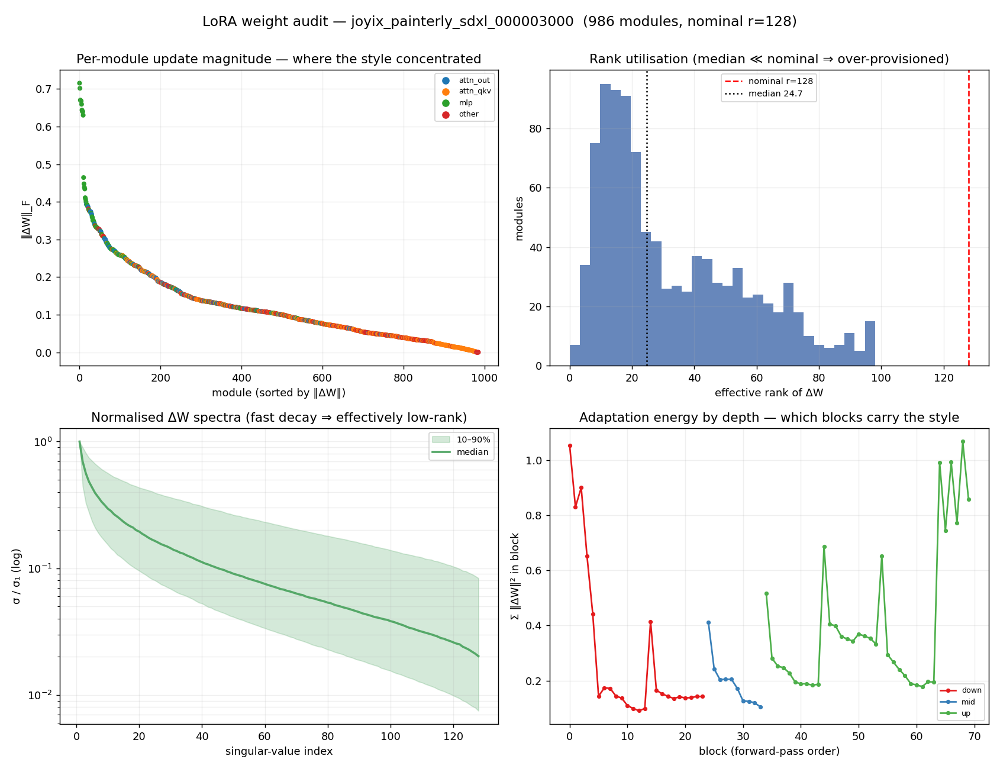

*painterly SDXL weight audit — same shape: the up-block MLPs dominate, in a handful of low-rank directions.*
{:.caption}

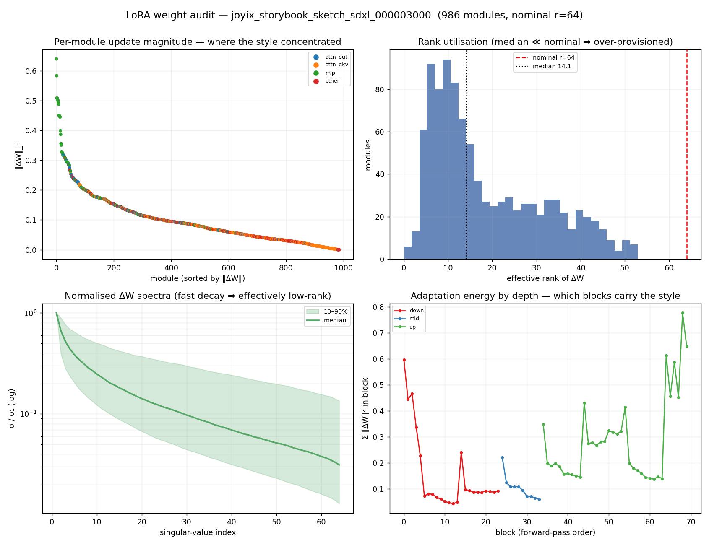

*storybook_sketch SDXL weight audit (rank 64, its shipped tensor) — same shape: up-block MLPs dominate, low effective rank.*
{:.caption}

### Why the FLUX spectra band is wider — architecture, not data

The normalised-spectra panel (bottom-left of each audit figure) shades the 10–90% band
of σ_i/σ₁ across modules; its *width* is module-to-module heterogeneity in decay shape —
wide ⇒ some modules are near rank-1 while others stay nearly flat. The FLUX panel
shows a visibly wider band than any of the SDXL panels, and it is worth settling what
that reflects. Reducing each adapter to one comparable scalar — the mean band width
over fractional rank positions (5/10/25/50%, so a rank-64 and a rank-128 adapter share
the same relative axis):

| LoRA | base | rank | band width | eff-rank range (p10 → p90) | CoV |
|---|---|---|---|---|---|
| `ink_wash` | FLUX | 64 | **1.18 dec** | 1.5 → 30.8 (min 1.1, max 49.2) | 0.76 |
| `nrtcel` | SDXL | 64 | 0.62 dec | 5.4 → 38.2 | 0.65 |
| `painterly` | SDXL | 128 | 0.67 dec | 9.4 → 69.1 | 0.71 |
| `storybook_sketch` | SDXL | 64 | 0.62 dec | 5.7 → 39.4 | 0.68 |


*Cross-LoRA normalised ΔW spectra with their 10–90% bands, index axis as a fraction of nominal rank so ranks align. The FLUX band is roughly twice as wide as every SDXL band while the median curves nearly coincide — architecture, not data.*
{:.caption}

Three factors separate cleanly:

- **It is the base model.** At matched rank 64 the FLUX band (1.18 dec) is about twice
  every SDXL band (0.62 dec). Holding rank fixed isolates the architecture.
- **It is not the data.** Two unrelated SDXL datasets at the *same* rank 64 — a public
  character set and a bespoke style — land at an identical 0.62 dec. The style being
  adapted barely moves the spread.
- **It is not mainly the rank.** The same dataset at both ranks settles it:
  `storybook_sketch` spreads 0.62 dec at rank 64 and 0.69 at rank 128 — a ~0.07
  widening for doubling the rank, an order of magnitude below the FLUX–SDXL gap
  (`painterly`, at rank 128, sits at 0.67). Rank lengthens the index axis without much
  stretching the band.

The mechanism is the **floor** of the effective-rank distribution. SDXL's lowest-rank
modules bottom out around eff-rank 5–9 (the p10 column); FLUX's p10 is 1.5, with a
population of modules that are essentially **rank-1** — one singular direction holds
nearly all of that module's ΔW energy, so σ₂/σ₁ collapses and the module sits a full
decade below the median, pulling the bottom of the band down. Those near-rank-1
modules are the same high-energy late single-block feed-forward projections identified
above, and they coexist in one network with higher-rank attention projections (up to
eff-rank ~49). A module population spanning rank-1 to rank-49 is what stretches the
band; SDXL's UNet drives no module that close to rank-1, so its per-module curves
bunch together and its band stays narrow. The median curves themselves sit close
together across both bases (median σ/σ₁ ≈ 0.06–0.10 at the half-rank index), so the
difference is dispersion, not a faster average decay.

This is also a reading caution for the panels above: the FLUX figure and the SDXL
figures differ in base, dataset, and (for two of them) rank at once, so the wider FLUX
band reflects architectural module heterogeneity — not `ink_wash` being intrinsically
harder or more rank-hungry than the SDXL styles.

The audit says *where* and *how much* the weights moved; it does not say *what visual
feature* each direction encodes, or *where* on the canvas the style acts. The next
probe addresses the "where."

### Where the trigger acts — and what a baseline reveals

The weight audit is static — it reads the adapter at rest. To see what happens at
generation time, a DAAM-style probe records, during a real generation, how much each
image position attends to each text token (the diffusion counterpart of a saliency
map), and overlays that per-token heatmap on the output. The probe loads the **full**
adapter (both the UNet and the text-encoder halves) and renders with the production
sampler recipe, so its image tracks normal output rather than drifting toward a
washed-out render; the attention *pattern* is the result either way.

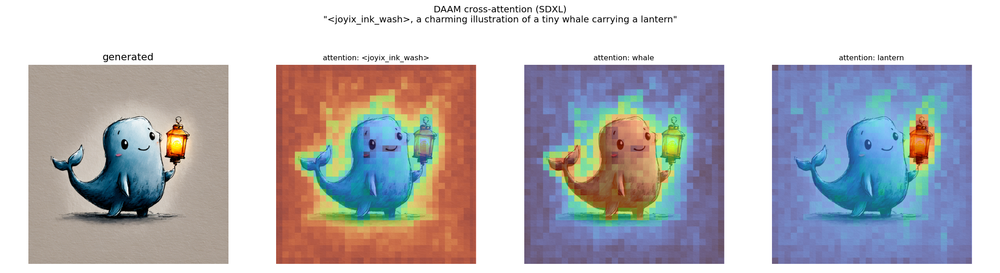

*SDXL attention attribution, LoRA on: the whale-with-lantern generation, then per-token heatmaps — content words land on their objects, the trigger is diffuse.*
{:.caption}

Two things show up: content words — *whale*, *lantern* (and on FLUX, *birds*,
*branch*) — concentrate on their objects, and the trigger token is diffuse. The
tempting reading is "the trigger learned to control the whole-image style." A
**baseline control settles whether that's true**: run the same probe with the LoRA
turned *off* (scale 0). The attribution barely moves —

| token | LoRA off | LoRA on |
|---|---|---|
| trigger token | 48% | 47% |
| whale | 40% | 38% |
| lantern | 48% | 48% |

(mass-50%-area; higher = more spread; identical seed/steps/size). With and without the
LoRA the trigger is equally diffuse and the content words equally localised — only the
rendered *style* changes (the LoRA-off image is plain base-model, not ink-wash):

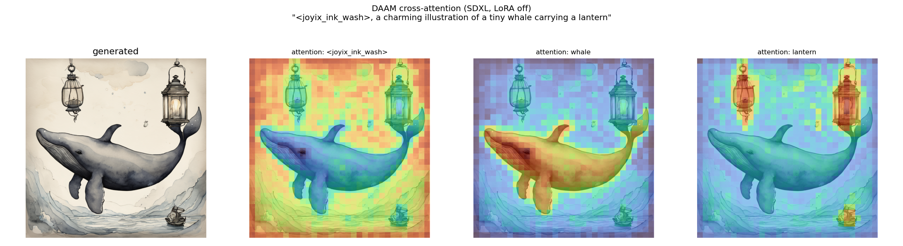

*The same prompt with the LoRA off (baseline): near-identical attention maps — only the rendered style changes. Without this control, the diffuse trigger map reads as a finding; with it, the finding evaporates.*
{:.caption}

So the honest conclusion is the **opposite** of the tempting one: a *style* LoRA's
effect is largely **invisible to attention attribution**. Cross-attention attribution
reflects *semantic layout* — which region cares about which word — and a style LoRA
changes *appearance*, not semantics. Content words localise because the *base model*
already knows them; the trigger is diffuse because it is an uninformative multi-subword
token that attracts sink-like attention — both true with or without the LoRA. The
trigger's spread is **not** evidence of a learned global-style role.

The pattern is not specific to ink_wash. Running the identical on/off probe on the
other two SDXL sub-styles — same prompt (a mouse in a top hat at a tea table), same
seed — reproduces it: the per-token maps barely move between LoRA-on and LoRA-off,
while only the rendered *medium* changes. For `painterly`, the LoRA turns a plain base
render into oil-brush colour; the trigger stays diffuse and *mouse* / *table* / *hat*
stay pinned to their objects either way:

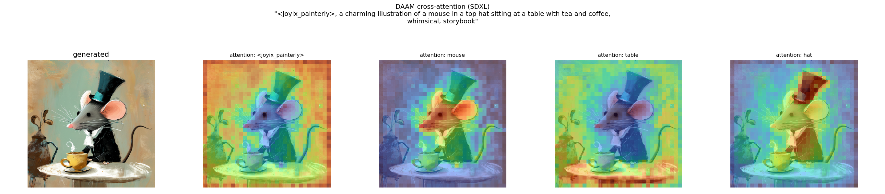

*painterly SDXL attention attribution, LoRA on: an oil-painterly mouse in a top hat — trigger diffuse, mouse/table/hat localised.*
{:.caption}

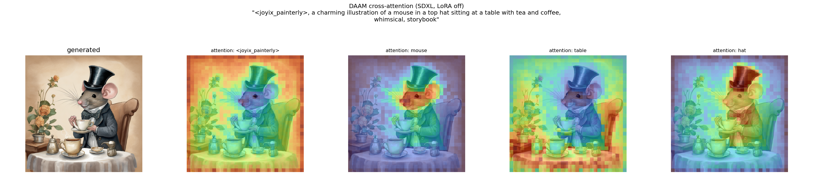

*painterly, LoRA off (baseline): the same prompt in plain base-model style, with near-identical attention maps.*
{:.caption}

For `storybook_sketch`, the LoRA swaps the same base scene for pen-and-ink line work —
and again the attribution is unchanged, only the medium:

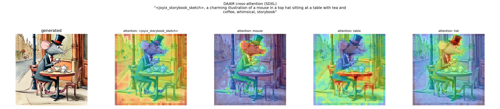

*storybook_sketch SDXL attention attribution, LoRA on: a pen-and-ink storybook mouse — trigger diffuse, mouse/table/hat localised.*
{:.caption}

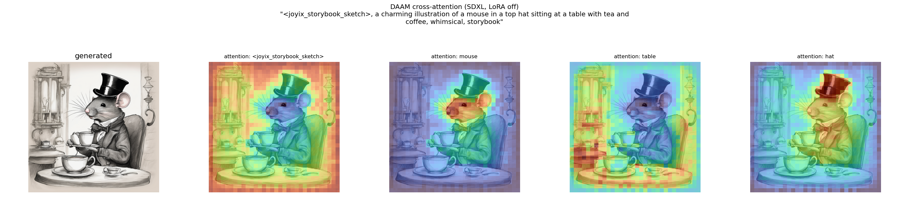

*storybook_sketch, LoRA off (baseline): the same prompt in plain base-model style, with near-identical attention maps.*
{:.caption}

The probe is still good for one thing — confirming that *content* tokens land on their
objects, a clean check that prompt and image align. It works identically on FLUX, whose
MMDiT *joint* attention needs a different extraction (intercepting the joint attention
and isolating the image→text block; all 57 attention layers × every step were
captured); there *birds* and *branch* localise even more sharply:

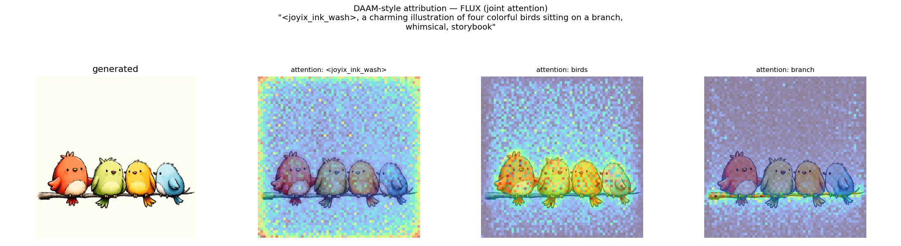

*FLUX attention attribution (joint MMDiT attention): four birds on a branch — 'birds' on the birds, 'branch' along the branch, trigger diffuse.*
{:.caption}

The same off-switch closes the loop on FLUX too: with the LoRA off the birds render in
plain base style, yet *birds* and *branch* land in the same places — the attribution is
a property of the base model's joint attention, not the style adapter:

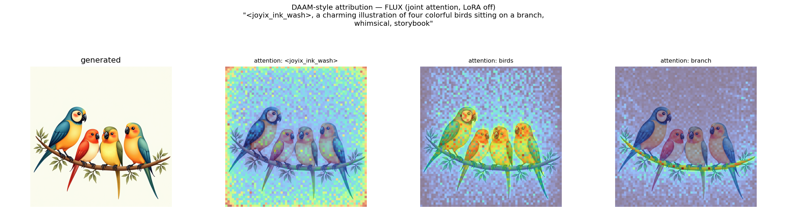

*FLUX, LoRA off (baseline): the same birds/branch localisation in plain base style — the attribution is a property of the base model's joint attention, not the style adapter.*
{:.caption}

But for understanding what a *style* LoRA learned, attention attribution is the wrong
lens — the weight audit above and the perceptual DINOv2 metric (§5) are the right ones.
The real lesson is about the **baseline**: without it, the diffuse trigger map reads as
a finding; with it, the finding evaporates. (FLUX runs on the larger training hardware;
SDXL — including the LoRA-on/off A/B above — runs on a single consumer card.)

---

## 9. SDXL results across all three sub-styles

SDXL is the workhorse platform; all three styles were trained and evaluated on it
first. All numbers are **best-checkpoint, in-domain, 2-seed mean** (best step selected
per style/seed on the stable mean, then averaged over two training seeds). `gate` is
each folder's calibrated p25 (§3).

| sub-style | best-ckpt (per seed) | mean | gate | margin | rate | memo |
|---|---|---|---|---|---|---|
| **painterly** | s1:step3500 / s2:step3000 | 0.575 | 0.556 | **+0.018** | 66% (peak 73%) | 0% |
| **storybook_sketch** | s1:step4000 / s2:step5000 | 0.635 | 0.629 | **+0.006** | 53% | 0% |
| **ink_wash** (213, rank 128) | s1:step4500 / s2:step2500 | 0.609 | 0.659 | **−0.050** | 42% | 0% |

Reads:

- **All three underfit the 90% rate bar** — none is "done" on SDXL.
- **painterly and storybook *clear their gate on the mean*** (positive margin) but
  still miss the rate bar — their output distribution sits *on* the gate, so the rate
  is a coin-flip (§5.1). They need a small push, not a platform change. painterly's
  free win is pure checkpoint selection: ~66% at its best step vs 49% at `final`.
- **ink_wash is the outlier** — the only style whose *best* checkpoint mean sits
  *below* its (highest) gate. It became the priority and the deep-dive subject.

### ink_wash SDXL — isolating set size vs rank

ink_wash was reduced from a 213-image set to a **deliberate 109-image variety pick**
(subject/design diversity at one consistent style — *not* a random subset). Its
intra-set stats nearly match the 213 (mean 0.701 vs 0.710, **p25 0.658 ≈ 0.659**), so
it's scored against its own folder and stays directly comparable to the 213 baseline
with no restore-to-213 needed.

| variant | set / rank | mean | gate | margin | rate | memo |
|---|---|---|---|---|---|---|
| baseline | 213 / rank 128 | 0.609 | 0.659 | −0.050 | 42% | 0% |
| set-size only | 109 / rank 128 | 0.615 | 0.658 | −0.043 | 42% | 0% |
| **+ rank 64** | 109 / rank 64 | **0.644** | 0.658 | **−0.014** | 47% | 0% |

**Verdict: set size is NOT the lever; rank is.** At matched rank 128 the 109 set only
ties the 213 baseline (0.615 vs 0.609, within the noise band) — the "smaller set = more
per-image exposure = better" hypothesis is *false*. Dropping **rank 128 → 64** on the
109 set is what lifts the best-checkpoint mean to **0.644** (+0.035 over baseline) with
memo still 0%: lower adapter capacity = less overfit on the smaller set. This is the
**best honest ink_wash SDXL result** — but still −0.014 under gate and 47% ≪ 90%. (A
separate 31-image flat-texture-curation probe, `sktchyInk`, cleared its *own* gate but
memorized 13–19% and only *tied* 109+rank64 on the common bar — the curation
*principle* transfers, the tiny set overfits.)

The standard-dataset run in §5 supplies the **complement**, and it flips the sign:
`nrtcel` (1107 images, ~10× ink_wash) is **better at rank 64 than rank 32** — at
matched eval prompts, **0.666 vs 0.602 (+0.064)**, and the gap holds at matched step,
so it's a rank effect not a step-count one. (Prompt-set sensitivity on that comparison
was ~0.008 — the same rank-64 LoRA scored 0.658 vs 0.666 on two independently-derived
50-subject sets — an order of magnitude below the rank effect, so it isn't a prompt
artifact.) So "lower rank wins" is **not** a law. The ink_wash↔nrtcel contrast reads as
**match rank to set size** — a small set (109) overfits the extra capacity so dropping
rank helps; a large, genuinely varied set (1107) *uses* it so raising rank helps. But
set size turns out to be only a loose proxy for the real variable, as two more small
sets show next.

### Two more small sets: the rank reduction does not generalize uniformly

If the rule were strictly set size, `painterly` (~130 images) and `storybook_sketch`
(~106) — both small — should both improve at rank 64 the way ink_wash did. Each was
re-trained at rank 64 and scored on the same committed in-domain prompt set and gate as
the rank-128 runs. Two of the four rank-128 runs share their training seed with the
rank-64 runs — a within-seed A/B where rank is the only variable — while the other two
widen the rank-128 sample. Reading both the controlled within-seed Δ *and* the full
rank-128 seed range against the rank-64 one, neither small set reproduces the ink_wash
win:

| sub-style | rank-128 (mean, range; n) | rank-64 (mean, range; n) | within-seed Δ |
|---|---|---|---|
| `painterly` | 0.572, 0.550–0.600 (4) | 0.561, 0.559–0.562 (2) | −0.025, +0.006 |
| `storybook_sketch` | 0.639, 0.632–0.643 (4) | 0.647, 0.645–0.649 (2) | +0.004, +0.006 |

Best-checkpoint in-domain mean; within-seed Δ is rank-64 minus rank-128 on each of the
two shared seeds.

- **`painterly` shows no reliable rank effect.** Its rank-64 runs (0.559–0.562) sit
  *inside* the far wider rank-128 seed range (0.550–0.600) — no separation — and the two
  within-seed deltas disagree on sign (−0.025 and +0.006), so the apparent rank-64
  penalty is one seed, not a trend. What rank 64 *does* do is collapse the seed spread,
  0.050 → 0.003: lower capacity is more seed-stable, but at the same mean, not a higher
  one.
- **`storybook_sketch` mildly prefers rank 64.** Both rank-64 runs (0.645, 0.649) clear
  *every* one of the four rank-128 runs (top 0.643), and both within-seed deltas are
  positive (+0.004, +0.006) — +0.005 on the seed-matched mean. A clean separation, but
  a small one, at the prompt-set noise floor.

Three small sets, three answers: ink_wash gains clearly at rank 64 (+0.029), storybook
marginally (+0.005), painterly not at all (a seed-volatile wash). So the operative
variable is **not set size** — all three are small — but how much genuine variation a
set carries, i.e. how much adapter capacity the style actually uses. The lever is still
rank; the honest rule is **match rank to the variation the data carries, for which set
size is only a rough stand-in.** A single set's rank-64 win does not transfer on size
alone.

### The shared wall: ~0% diversity on all three

Held-out novel-subject prompts (the 5-prompt tail), per-image DINOv2 vs the relaxed p10
gate:

| sub-style | diversity sims (5) | p10 gate | rate |
|---|---|---|---|
| ink_wash | 0.56, 0.44, 0.38, 0.57, 0.51 | 0.614 | **0%** |
| painterly | 0.29, 0.21, 0.42, 0.43, 0.33 | ~0.50 | **0%** |
| storybook_sketch | 0.51, 0.47, 0.32, 0.46, 0.36 | ~0.58 | **0%** |

All three collapse to ~0% on novel subjects — a uniform **out-of-domain generalization
gap** that no recipe knob fixes. These folders *pass* the caption-diversity audit (no
single subject family dominates), yet still collapse out-of-domain — so the lever is
broader reference + caption subject coverage (§6, the data lever), not a recipe change.
This is the clean empirical separation of the two failure modes: in-domain underfit
moved with rank; the diversity wall did not move with *any* recipe knob.

---

## 10. FLUX (ink_wash) — the recipe frontier

FLUX is the hero-quality platform but was the *last* lever, run only after the cheap
SDXL levers stalled, and judged on the same mean/margin bar — never promoted on its
"hero model" reputation.

| variant | mean | gate | margin | rate | note |
|---|---|---|---|---|---|
| FLUX, freeze-TE, no descriptor | 0.568 | 0.658 | −0.091 | 21% | decisively worse than SDXL (then) |
| **FLUX + TE-LR fix + descriptor@inference** (seed_42) | **0.668** | 0.658 | **+0.010** | 67% | clears gate; beats SDXL 0.644 |
| FLUX, same recipe, seed_77 | 0.583 | 0.658 | −0.075 | — | **same recipe, ±0.085 worse** |
| FLUX, descriptor **in training** (seed_42) | 0.612 | 0.658 | −0.046 | — | **regression** → §4 |

Two interventions un-shelved FLUX from 0.568 to ~0.67:

1. **TE-LR fix** — a small tracked patch to the trainer, pinned to a specific upstream
   commit, that wires up the parsed-but-ignored per-group learning rates (set
   `text_encoder_lr 1e-5` / `unet_lr 1e-4`) **and** routes the warmup-step count
   through the scheduler (stock behaviour silently defaulted warmup to 1000 steps and
   ignored it for cosine entirely). The recipe you *think* you're running was not the
   one that ran — see §11.
2. **Textured-paper descriptor at inference** (NOT in training — the
   descriptor-in-training A/B in §4 shows that regresses it).

But the dominant variable turned out to be the **training seed**: the ~0.085
seed_42↔seed_77 gap persists across every generation-seed (§6), ~4× the eval noise. So
FLUX *with the right seed* beats the SDXL platform (+0.024 over 0.644) — but a single
seed lands ±0.085 apart, making **best-of-N training-seed selection mandatory**. Even
the best seed only clears its own gate by +0.010 (short of the strict +0.02 adopt line)
and still fails the 90% rate + 0% diversity. ink_wash is **shelved at the ~0.67
ceiling** — a cost/priority call, with the untouched data lever (§9) the remaining
frontier, not a proven hard ceiling.

---

## 11. The architectural finding that bounded the recipe frontier

On FLUX, the trainer's text-encoder LoRA targets only the CLIP attention / MLP modules,
so it adapts **CLIP-L only; T5-XXL stays frozen** (it only touches T5 for a different
architecture). This is verified in the trainer's source — and the diffusers reference
FLUX LoRA script does the same under `--train_text_encoder`, so it's a **platform
convention, not a trainer quirk**. Implications, given the results:

- The TE "win" is a **global pooled-style-vector** shift (CLIP-L feeds FLUX's AdaLN
  modulation), **not** per-word binding (T5, which carries the detailed semantics, is
  untouched).
- This **predicts** the descriptor-in-training regression (§4): you cannot bind texture
  into frozen-T5 descriptor tokens, so naming it only steals ownership from the trigger.
- It **decouples the TE lever from the diversity hole** (the semantics encoder isn't
  trained) → the 0% diversity is a **data** problem, confirming §9's split.

Two trainer-internals corollaries that changed *what actually ran*: the per-group
learning rates (`text_encoder_lr` / `unet_lr`) were parsed but **never read** (both
groups hardcoded to the single base LR), and the warmup-step count was silently
ignored. Both are fixed by the tracked patch (§10). The lesson: **know your trainer's
internals** — the recipe you configure may not be the recipe that executes.

---

## 12. What generalizes (the transferable checklist)

1. **Pick a style-dominant embedder** (DINOv2 — strongly style-weighted, though not
   subject-invariant) and use it for *everything* — triage, curation, eval. One feature
   space = "passes triage" and "passes eval" mean the same thing. Because it stays
   entangled with subject and layout, gate on it *relatively* (same-subject
   distribution, mean over many images), never as an absolute per-image style score.
2. **Calibrate every gate to the dataset's own distribution** (per-folder p25 / p10),
   never a guessed absolute. (Three styles → three gates: 0.556 / 0.629 / 0.658.)
3. **Gate coherence before you train** — move detection upstream of GPU spend; let a
   non-zero pre-flight halt the run.
4. **Captions: build forward from bare subjects; caption what varies, omit what the
   trigger owns.** Freeze the inference prompt per-LoRA to kill drift. And **validate
   the subject tier** — a public dataset's captions are unvalidated input ("on a model
   hub" ≠ checked), and the build propagates a wrong subject faithfully.
5. **Grade on the mean at the best checkpoint, in-domain**, with the diversity tail
   scored separately at a relaxed gate.
6. **Treat the noise band as a number.** Pre-declare an adopt threshold (> 0.02 over
   gate). Separate training-seed effect from eval noise with a sweep.
7. **Separate the two failure modes** (in-domain underfit = recipe; out-of-domain =
   data) and map each lever to the mode it can actually move.
8. **Know your trainer's internals** — per-group LR and warmup were silently ignored;
   the FLUX TE-LoRA is CLIP-L-only. The recipe you *think* you're running may not be the
   one that ran.

---

## 13. Tooling landscape: what exists, what's missing

The diagnostics here are assembled from techniques that already exist across ML, not
invented for this project. This section is a map of what is and isn't routinely
available, so the gaps are explicit and so anyone wanting to go further knows what to
read.

**What general-purpose LoRA training frameworks expose today** (kohya_ss / sd-scripts,
ai-toolkit, OneTrainer, the diffusers training scripts): training-loss scalars,
periodic sample images at fixed prompts, and basic TensorBoard logging. The diffusion
training loss is a weak quality signal — it's averaged over random timesteps and noise
levels, so it barely tracks sample quality — which is why the working signal in
practice is eyeballing the sample images. Rank, LR, and steps are set by convention.

**What exists in research / adjacent tooling but is rarely wired into LoRA training:**

- *Attribution / interpretability:* **DAAM** (cross-attention attribution — a spatial
  saliency map per prompt token), attention rollout, Prompt-to-Prompt — the diffusion
  analog of Grad-CAM, mapping a generation back onto the tokens and regions that drove
  it.
- *Adapter analysis:* SVD / spectral analysis of the LoRA update (**AdaLoRA** allocates
  rank by singular-value importance); block-wise LoRA weighting (per-block rank / LR).
  The §8 weight audit is in this family.
- *Data quality:* confident-learning and data auditing (**cleanlab**), data-validation
  frameworks (TFX Data Validation, Great Expectations), dataset cartography. The §2–§3
  curation gate and the §7 latent audit are in this family.
- *Generative evaluation:* learned human-preference models (**HPSv2**, **ImageReward**,
  **PickScore**) and distributional metrics (FID, CLIP-score). The §5 DINOv2 gate is a
  dataset-relative instance of this idea.
- *Style representation:* Gram-matrix / VGG style statistics (the classic
  neural-style-transfer signal) as a second, mechanistically independent style metric.

**What is missing as routine LoRA-training diagnostics — candidate additions to a
framework:**

- a post-train **weight report** (effective rank per layer, ΔW by block) to inform rank
  and block-targeting (§8);
- **dataset-relative on-style gating** instead of fixed similarity thresholds (§3);
- **input-integrity checks** on the latent cache — corrupt / anomalous / mixed-base
  latents (§7);
- **held-out generalization and memorization** numbers emitted as standard train
  outputs (§5–§6), rather than inferred from sample grids;
- **activation / attention attribution** wired into the sample previews, so a preview
  answers "where did the trigger act," not only "does it look right."

The individual pieces are established and well-documented; the aim here is just to
gather them in one place and run them as part of a LoRA train, in case that's a useful
starting point for someone learning the same thing. The attribution row above
(DAAM-style) is built and verified on both SDXL and FLUX (§8) — and a baseline control
there shows it reflects *semantic* layout, not the style LoRA, so it reads
content-token localisation but not the style itself.

---

## Reproducibility & method notes

Every figure and number above is read back, by small reader scripts, from artifacts
saved at generation time — none is hand-tuned for the writeup. In brief:

- **Eval numbers** (the SDXL/FLUX best-checkpoint tables) come from the per-image
  DINOv2 scores stored in each eval run's report, re-aggregated to the best-checkpoint,
  in-domain, 2-seed mean. Scoring is independent of generation, so reports are
  re-readable — and correctable — without regenerating images.
- **Calibrated gates** are the per-folder p25 of the reference set's intra-set DINOv2
  cosine distribution (§3).
- **Reference-distribution figures** (ridgeline, 2-D embedding map, separability table)
  are pure readers over the cached DINOv2 embeddings — no GPU, no re-embed.
- **VAE round-trip** decodes the cached training latents through the local VAE and
  compares to the originals (PSNR + DINOv2 cosine); the **latent data-integrity** audit
  reads the same latents as raw tensors (no VAE, no GPU).
- **The weight audit** (§8) reads the trained LoRA's weight file directly and
  reconstructs each layer's update ΔW = B·A; its singular values come from a small r×r
  SVD, so the base model is never loaded.
- Two **external-code findings** are load-bearing: the trainer's text-encoder LoRA
  targets only the CLIP attention / MLP modules, so on FLUX it adapts CLIP-L and leaves
  T5 frozen (§11); and a small tracked patch fixes the trainer's per-group learning-rate
  and warmup handling (§10), pinned to a specific upstream commit so the fix is
  reproducible.
